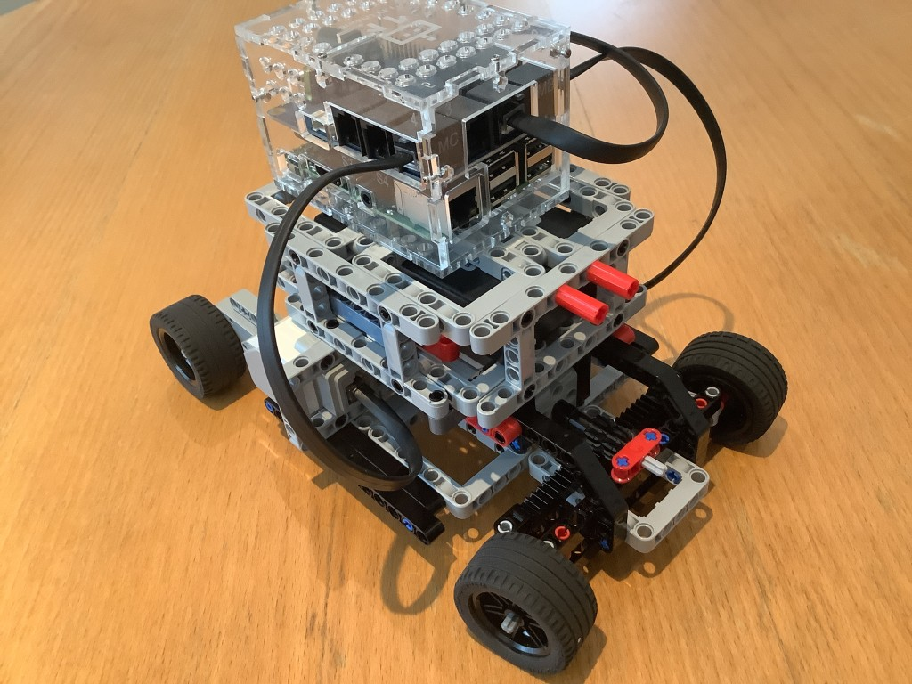

# Final Assembly Instructions

The steering mechanism below was inspired by YouTube: Bricks Master Builders (retrieved 22/07/2025), LEGO Technic Simple Rack & Pinion Steering Module: https://www.youtube.com/watch?v=olrBk-QonG8

Time to wire up...
Left wheel goes to PORT A, right wheel to PORT_D, steering goes to PORT_B.

