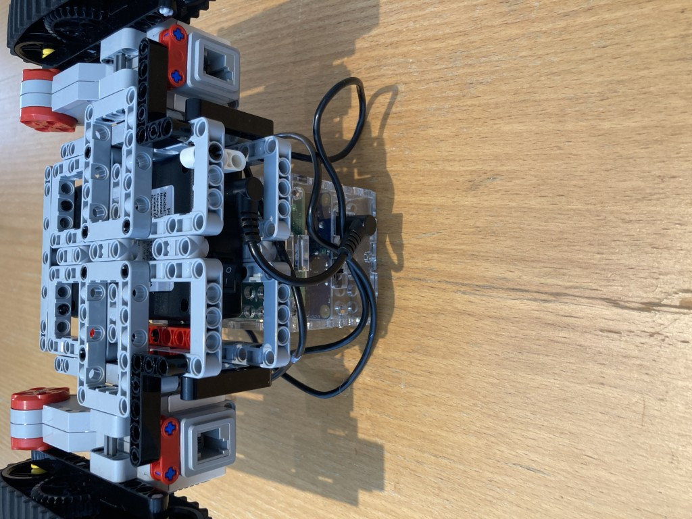

# Final Assembly Instructions

In the below picture, the 2 yellow triple pins half inserted are not part of the model. I have placed them here to indicate where the blue pins in the above picture should be inserted.

Time to wire up...
The Terry configuration files assume the following wiring: going clockwise, viewed from above starting at front: PORT_D, PORT_A, PORT_B

